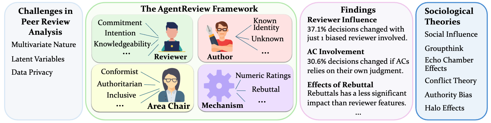
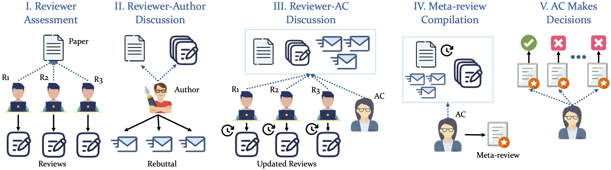

# AgentReview

Official implementation for the 🔗[EMNLP 2024](https://2024.emnlp.org/) main track (Oral) paper -- **[AgentReview: Exploring Peer Review Dynamics with LLM Agents](https://arxiv.org/abs/2406.12708)**

[💡Demo](https://huggingface.co/spaces/Ahren09/AgentReview) ｜ [🌐 Website](https://agentreview.github.io/) | [📄 Paper](https://aclanthology.org/2024.emnlp-main.70/) | [🔗arXiv](https://arxiv.org/abs/2406.12708) ｜ [💻Code](https://github.com/Ahren09/AgentReview)


```bibtex
@inproceedings{jin2024agentreview,
  title={AgentReview: Exploring Peer Review Dynamics with LLM Agents},
  author={Jin, Yiqiao and Zhao, Qinlin and Wang, Yiyang and Chen, Hao and Zhu, Kaijie and Xiao, Yijia and Wang, Jindong},
  booktitle={EMNLP},
  year={2024}
}
```



---

## Introduction

AgentReview is a pioneering large language model (LLM)-based framework for simulating peer review processes, developed to analyze and address the complex, multivariate factors influencing review outcomes. Unlike traditional statistical methods, AgentReview captures latent variables while respecting the privacy of sensitive peer review data. 

### Academic Abstract

Peer review is fundamental to the integrity and advancement of scientific publication. Traditional methods of peer review analyses often rely on exploration and statistics of existing peer review data, which do not adequately address the multivariate nature of the process, account for the latent variables, and are further constrained by privacy concerns due to the sensitive nature of the data. We introduce AgentReview, the first large language model (LLM) based peer review simulation 
framework, which effectively disentangles the impacts of multiple latent factors and addresses the privacy issue. Our study reveals significant insights, including a notable 37.1% variation in paper decisions due to reviewers' biases, supported by sociological theories such as the social influence theory, altruism fatigue, and authority bias. We believe that this study could offer valuable insights to improve the design of peer review mechanisms.




## Getting Started

### Installation

**Download the data**

Download both zip files in this [Dropbox](https://www.dropbox.com/scl/fo/etzu5h8kwrx8vrcaep9tt/ALCnxFt2cT9aF477d-h1-E8?rlkey=9r5ep9psp8u4yaxxo9caf5nnc&st=aymhgu32&dl=0):

Unzip [AgentReview_Paper_Data.zip](https://www.dropbox.com/scl/fi/l17brtbzsy3xwflqd58ja/AgentReview_Paper_Data.zip?rlkey=vldiexmgzi7zycmz7pumgbooc&st=b6g3nkry&dl=0) under `data/`, which contains:
   1. The PDF versions of the paper
   2. The real-world peer review for ICLR 2020 - 2023
   
   ```bash
   unzip AgentReview_Paper_Data.zip -d data/
   ```

(Optional) Unzip [AgentReview_LLM_Reviews.zip](https://www.dropbox.com/scl/fi/ckr0hpxyedx8u9s6235y6/AgentReview_LLM_Reviews.zip?rlkey=cgexir5xu38tm79eiph8ulbkq&st=q23x2trr&dl=0) under `outputs/`, which contains the LLM-generated reviews, (our LLM-generated dataset)
    
   ```bash
   unzip AgentReview_LLM_Review.zip -d outputs/
   ```
   
**Install Required Packages**:
   ```
   cd AgentReview/
   pip install -r requirements.txt
   ```

3. Set environment variables

If you use OpenAI API, set OPENAI_API_KEY.

```bash
export OPENAI_API_KEY=... # Format: sk-...
```

If you use AzureOpenAI API, set the following

```bash
export AZURE_ENDPOINT=...  # Format: https://<your-endpoint>.openai.azure.com/
export AZURE_DEPLOYMENT=...  # Your Azure OpenAI deployment here
export AZURE_OPENAI_KEY=... # Your Azure OpenAI key here
```
   
**Running the Project**

   Set the environment variables in `run.sh` and run it:
   
   ```bash
   bash run.sh
   ```  

   **Note: all project files should be run from the `AgentReview` directory.**

**Demo**

A demo can be found in `notebooks/demo.ipynb`

### Customizing your own environment

You can add a new setting in `agentreview/experiment_config.py`, then add the setting as a new entry to the `all_settings` dictionary:

```python
all_settings = {
    "BASELINE": baseline_setting,
    "benign_Rx1": benign_Rx1_setting,
    ...
    "your_setting_name": your_setting
```

## Framework Overview

### Stage Design

Our simulation adopts a structured, 5-phase pipeline

* **Phase I. Reviewer Assessment.** Each manuscript is evaluated by three reviewers independently.
* **Phase II. Author-Reviewer Discussion.** Authors submit rebuttals to address reviewers' concerns;
* **Phase III. Reviewer-AC Discussion.** The AC facilitates discussions among reviewers, prompting updates to their initial assessments.
* **Phase IV. Meta-Review Compilation.** The AC synthesizes the discussions into a meta-review.
* **Phase V. Paper Decision.** The AC makes the final decision on whether to accept or reject the paper, based on all gathered inputs.

## Note

- We use a fixed acceptance rate of 32%, corresponding to the actual acceptance rate of ICLR 2020 -- 2023. See [Conference Acceptance Rates](https://github.com/lixin4ever/Conference-Acceptance-Rate) for more information.
- Sometimes the API can apply strict filtering to the request. You may need to adjust the content filtering to get the desired results.  


## License

This project is licensed under the Apache-2.0 License.

## Acknowledgements

The implementation is partially based on the [chatarena](https://github.com/Farama-Foundation/chatarena) framework.
