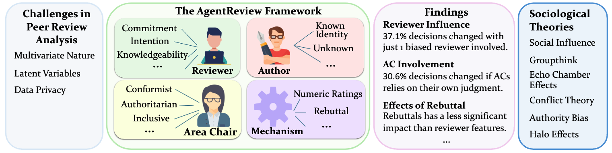

# AgentReview

Official implementation for the 🔗[EMNLP 2024](https://2024.emnlp.org/) (main) paper: [AgentReview: Exploring Peer Review Dynamics with LLM Agents](https://arxiv.org/abs/2406.12708)

🌐 Website: [https://agentreview.github.io/](https://agentreview.github.io/)


```bibtex
@inproceedings{jin2024agentreview,
  title={AgentReview: Exploring Peer Review Dynamics with LLM Agents},
  author={Jin, Yiqiao and Zhao, Qinlin and Wang, Yiyang and Chen, Hao and Zhu, Kaijie and Xiao, Yijia and Wang, Jindong},
  booktitle={EMNLP},
  year={2024}
}
```



---

### Introduction

Agent4Review is a simulation framework for systematic analysis of the peer review process based on large language models (LLMs). This framework aims to understand decision-making patterns, reviewer behavior, and the dynamics of paper acceptance and rejection.

### Academic Abstract

Peer review is fundamental to the integrity and advancement of scientific publication. Traditional methods of peer review analyses often rely on exploration and statistics of existing peer review data, which do not adequately address the multivariate nature of the process, account for the latent variables, and are further constrained by privacy concerns due to the sensitive nature of the data. We introduce AgentReview, the first large language model (LLM) based peer review simulation framework, which effectively disentangles the impacts of multiple latent factors and addresses the privacy issue. Our study reveals significant insights, including a notable 37.1% variation in paper decisions due to reviewers' biases, supported by sociological theories such as the social influence theory, altruism fatigue, and authority bias. We believe that this study could offer valuable insights to improve the design of peer review mechanisms

### Stage Design


#### Installation

1. **Install Required Packages**:
   ```
   cd AgentReview
   pip install -r requirements.txt
   ```
   
2. **Run the Project**:

   **Note: all project files should be run from the `AgentReview` directory.**
    

#### Project Structure
- `app.py`: The main application file for running the framework.
- `analysis/`: Contains Python scripts for various statistical analyses of review data.
- `chatarena/`: Core module for simulating different review environments and integrating LLM backends.
- `dataset/`: Scripts for handling dataset operations, such as downloading and processing submissions.
- `demo/`: Demonstrative scripts showcasing the functionality of different components.
- `docs/`: Documentation files and markdown guides for using and extending the framework.
- `examples/`: Configuration files and examples to demonstrate the capabilities and setup of simulations.
- `experiments/`: Experimental scripts to test new ideas or improvements on the framework.
- `visual/`: Visualization scripts for generating insightful plots and charts from the simulation data.

#### Usage
To run a basic simulation:
```
python app.py --config examples/basic_simulation.json
```

For detailed analysis on a specific dataset:
```
python analysis/stats_review_length.py --dataset path/to/your/dataset
```

## Note

- We use a fixed acceptance rate of 32%, corresponding to the actual acceptance rate of ICLR 2020 -- 2023. See [Conference Acceptance Rates](https://github.com/lixin4ever/Conference-Acceptance-Rate) for more information.


## License

This project is licensed under the Apache-2.0 License.

## Acknowledgements

The implementation is partially based on the [chatarena](https://github.com/Farama-Foundation/chatarena) framework.

## Note

- Sometimes the API can apply strict filtering to the request. You may need to adjust the content filtering to get the desired results.  
