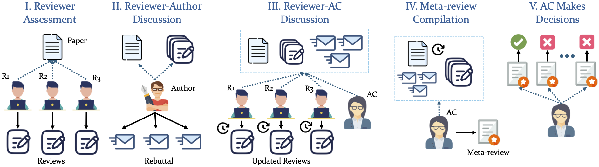

<h1 align="center">🎓 AgentReview</h1>

<p align="center"><em>The first LLM-agent simulation of the academic peer review process.</em></p>

<p align="center">
  <a href="https://aclanthology.org/2024.emnlp-main.70/"></a>
  <a href="https://arxiv.org/abs/2406.12708"></a>
  <a href="https://aclanthology.org/2024.emnlp-main.70/"></a>
  <a href="https://huggingface.co/spaces/Ahren09/AgentReview"></a>
  <a href="https://agentreview.github.io/"></a>
  <a href="https://github.com/Ahren09/AgentReview"></a>
  
  
  <a href="LICENSE"></a>
</p>

<p align="center">
  
</p>

<p align="center">
  <a href="https://ahren09.github.io/">Yiqiao Jin</a><sup>1*</sup> &middot;
  <a href="https://scholar.google.com/citations?user=0tiw7wgAAAAJ">Qinlin Zhao</a><sup>2*</sup> &middot;
  <a href="https://hello-diana.github.io/">Yiyang Wang</a><sup>1</sup> &middot;
  <a href="https://hhhhhhao.github.io/">Hao Chen</a><sup>3</sup> &middot;
  <a href="https://kaijiezhu11.github.io/">Kaijie Zhu</a><sup>4</sup> &middot;
  <a href="https://yijia-xiao.com/">Yijia Xiao</a><sup>5</sup> &middot;
  <a href="https://jd92.wang/">Jindong Wang</a><sup>6</sup>
</p>

<p align="center">
  <sup>1</sup>Georgia Institute of Technology &nbsp;
  <sup>2</sup>University of Science and Technology of China &nbsp;
  <sup>3</sup>Carnegie Mellon University &nbsp;<br>
  <sup>4</sup>UC Santa Barbara &nbsp;
  <sup>5</sup>UC Los Angeles &nbsp;
  <sup>6</sup>William &amp; Mary
</p>

<p align="center"><sub><sup>*</sup> Equal contribution.</sub></p>

---

## 📊 At a glance

| Metric | Value |
| --- | --- |
| Total generated peer review documents | **53,800+** |
| Reviews & rebuttals | **10,460** |
| Reviewer–AC discussions | **23,535** |
| Meta-reviews / final decisions | **9,414 / 9,414** |
| Conferences covered | **ICLR 2020 – 2023** |
| Submissions sampled (oral · spotlight · poster · reject) | **523** &nbsp;(19 · 29 · 125 · 350) |
| Decision variation attributable to reviewer bias | **37.1 %** |

---

## 📝 Abstract

Peer review is fundamental to the integrity and advancement of scientific publication. Traditional methods of peer review analyses often rely on exploration and statistics of existing peer review data, which do not adequately address the multivariate nature of the process, account for the latent variables, and are further constrained by privacy concerns due to the sensitive nature of the data. We introduce **AgentReview**, the first large language model (LLM) based peer review simulation framework, which effectively disentangles the impacts of multiple latent factors and addresses the privacy issue. Our study reveals significant insights, including a notable **37.1 % variation in paper decisions due to reviewers' biases**, supported by sociological theories such as the *social influence theory*, *altruism fatigue*, and *authority bias*. We believe that this study could offer valuable insights to improve the design of peer review mechanisms.

---

## 🏗️ Architecture

<p align="center">
  
</p>

AgentReview models peer review as a structured **five-phase pipeline** with three role types — *reviewers*, *authors*, and *area chairs* — each instantiated as an LLM agent with configurable latent traits. By varying one trait at a time against a fixed *baseline* setting, the framework disentangles otherwise-confounded factors such as reviewer commitment, intention, knowledgeability, AC style, and author anonymity, while preserving real reviewer privacy.

---

<details>
<summary><b>📑 Table of Contents</b></summary>

- [Key findings](#-key-findings)
- [Framework](#-framework)
  - [Roles](#roles)
  - [Five-phase pipeline](#five-phase-pipeline)
- [Installation](#-installation)
- [Data setup](#-data-setup)
- [Quick start](#-quick-start)
- [Customizing your own setting](#%EF%B8%8F-customizing-your-own-setting)
- [Notes](#-notes)
- [Citation](#-citation)
- [Acknowledgments](#-acknowledgments)
- [License](#%EF%B8%8F-license)

</details>

---

## ✨ Key findings

Five sociological phenomena emerge from the simulation, each tied to a measurable shift in review outcomes:

| Phenomenon | Sociological theory | Quantitative effect |
| --- | --- | --- |
| **Social Influence** | Conformity to perceived majority opinion | **−27.2 %** standard deviation in ratings after rebuttals |
| **Altruism Fatigue & Peer Effects** | One free-rider triggers collective disengagement | A single under-committed reviewer drives a **−18.7 %** drop in commitment across all reviewers |
| **Groupthink & Echo Chamber** | Amplification of negative views among biased peers | **−0.17** rating among biased reviewers, plus a **−0.25** spillover on unbiased reviewers |
| **Authority Bias & Halo Effect** | Renowned-author identity inflates perceived quality | Revealing identity for just **10 %** of papers shifts **27.7 %** of decisions |
| **Anchoring Bias** | Heavy reliance on initial impressions | The rebuttal phase exerts only a **minimal** effect on final outcomes |

---

## 🔬 Framework

### Roles

Three LLM-agent roles are configured along orthogonal trait axes, all set via prompts:

| Role | Trait axis | Variants |
| --- | --- | --- |
| **Reviewer** | Commitment | responsible · irresponsible |
| | Intention | benign · malicious |
| | Knowledgeability | knowledgeable · unknowledgeable |
| **Author** | Identity disclosure | anonymous · known |
| **Area Chair** | Decision style | authoritarian · conformist · inclusive |

### Five-phase pipeline

| Phase | Stage | What happens |
| :-: | --- | --- |
| **I** | Reviewer Assessment | Three reviewers independently evaluate each manuscript |
| **II** | Author–Reviewer Discussion | Authors submit rebuttals addressing reviewer concerns |
| **III** | Reviewer–AC Discussion | The AC facilitates discussion; reviewers update their initial ratings |
| **IV** | Meta-Review Compilation | The AC synthesizes all signals into a single meta-review |
| **V** | Paper Decision | The AC makes the final accept / reject call (fixed acceptance rate of 32 %) |

---

## 📦 Installation

| Requirement | Version |
| --- | --- |
| Python | 3.10+ |
| LLM access | OpenAI **or** Azure OpenAI API key |
| OS | Linux / macOS / WSL |

```bash
git clone https://github.com/Ahren09/AgentReview.git
cd AgentReview
pip install -r requirements.txt
```

<details>
<summary><b>🔑 Set environment variables — OpenAI</b></summary>

```bash
export OPENAI_API_KEY=sk-...
```

</details>

<details>
<summary><b>🔑 Set environment variables — Azure OpenAI</b></summary>

```bash
export AZURE_ENDPOINT=https://<your-endpoint>.openai.azure.com/
export AZURE_DEPLOYMENT=<your-deployment-name>
export AZURE_OPENAI_KEY=<your-key>
```

</details>

---

## 💾 Data setup

Two zip archives are hosted on [Dropbox](https://www.dropbox.com/scl/fo/etzu5h8kwrx8vrcaep9tt/ALCnxFt2cT9aF477d-h1-E8?rlkey=9r5ep9psp8u4yaxxo9caf5nnc&st=aymhgu32&dl=0):

| Archive | Contents | Target | Required? |
| --- | --- | --- | :-: |
| [`AgentReview_Paper_Data.zip`](https://www.dropbox.com/scl/fi/l17brtbzsy3xwflqd58ja/AgentReview_Paper_Data.zip?rlkey=vldiexmgzi7zycmz7pumgbooc&st=b6g3nkry&dl=0) | PDFs of sampled ICLR papers + real ICLR 2020–2023 reviews | `data/` | ✅ |
| [`AgentReview_LLM_Reviews.zip`](https://www.dropbox.com/scl/fi/ckr0hpxyedx8u9s6235y6/AgentReview_LLM_Reviews.zip?rlkey=cgexir5xu38tm79eiph8ulbkq&st=q23x2trr&dl=0) | The full LLM-generated review dataset from the paper | `outputs/` | optional |

```bash
unzip AgentReview_Paper_Data.zip   -d data/
unzip AgentReview_LLM_Reviews.zip  -d outputs/    # optional
```

---

## 🚀 Quick start

Run a full simulated review pass on ICLR 2024 with a `malicious_Rx1` reviewer setting:

```bash
python run_paper_review_cli.py \
    --conference ICLR2024 \
    --openai_client_type azure_openai \
    --data_dir data \
    --experiment_name malicious_Rx1
```

Or explore interactively:

- **Notebook** — [`notebooks/demo.ipynb`](notebooks/demo.ipynb)
- **Live demo** — [Hugging Face Space](https://huggingface.co/spaces/Ahren09/AgentReview)
- **End-to-end script** — [`run.sh`](run.sh)

> **Note:** all project files should be run from the `AgentReview` directory.

---

## 🛠️ Customizing your own setting

Define a new setting in `agentreview/experiment_config.py` and register it in `all_settings`:

```python
all_settings = {
    "BASELINE":   baseline_setting,
    "benign_Rx1": benign_Rx1_setting,
    # ...
    "your_setting_name": your_setting,
}
```

---

## 📌 Notes

- We use a fixed acceptance rate of **32 %**, matching the actual ICLR 2020–2023 average. See [Conference Acceptance Rates](https://github.com/lixin4ever/Conference-Acceptance-Rate) for context.
- API providers can apply strict content filtering. You may need to relax filtering on your deployment to obtain complete generations.

---

## 📚 Citation

```bibtex
@inproceedings{jin2024agentreview,
  title     = {AgentReview: Exploring Peer Review Dynamics with LLM Agents},
  author    = {Jin, Yiqiao and Zhao, Qinlin and Wang, Yiyang and Chen, Hao
               and Zhu, Kaijie and Xiao, Yijia and Wang, Jindong},
  booktitle = {Proceedings of the 2024 Conference on Empirical Methods in
               Natural Language Processing (EMNLP)},
  year      = {2024}
}
```

---

## 🤝 Acknowledgments

The implementation builds on the [chatarena](https://github.com/Farama-Foundation/chatarena) multi-agent framework, and uses the [OpenReview API](https://github.com/openreview/openreview-py) to retrieve real ICLR submission data.

---

## ⚖️ License

Released under the [Apache License 2.0](LICENSE).
